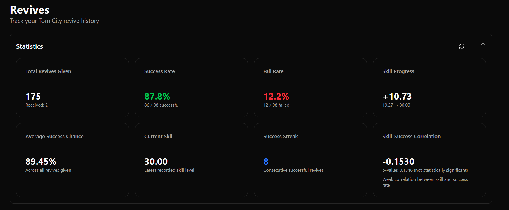
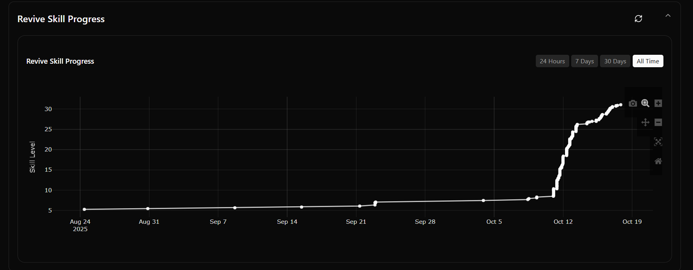
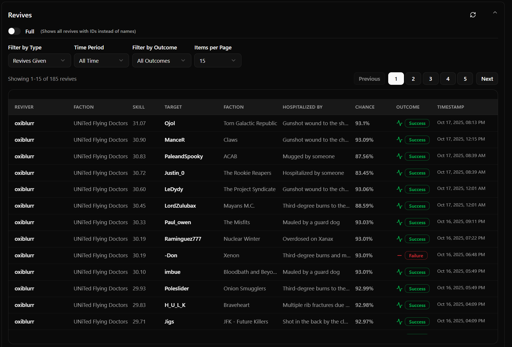

# Torn Revive

 

Track your revives and skill progression on torn.com

## Features

- [x] Login with Torn API Key (custom)
- [x] Overall Revive Statistics: View comprehensive stats for your revive activity.
- [x] Tabular Breakdown of Revives: Detailed table of individual revive events.
- [x] Add caching

## Planned Features

- [ ] Current revive cost calculator (based on faction perks).

## Screenshots

### Login

### Statistics

### Graph

### Table

## Contributing
Contributions are welcome! Please open an issue or submit a pull request with any improvements or bug fixes.
