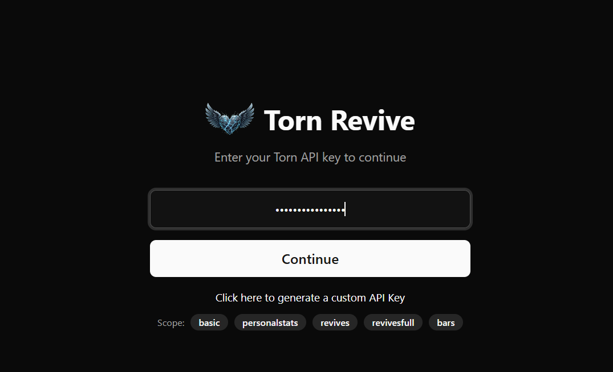

# Torn Revive

A analytics tool to track your revives on torn

## Features:

- [x] Overall revive statistics
- [x] Tabular breakdown of revives
- [x] Login page with token

## Planned

- [ ] Generate a custom API Key to fetch `/basic` and `/revives`
- [ ] Host frontend on github pages
- [ ] More analytics
- [ ] Revive success calculator
- [ ] Current revive cost (based on faction perks)

## Screenshots

### Login page

### Statistics

### Revives

